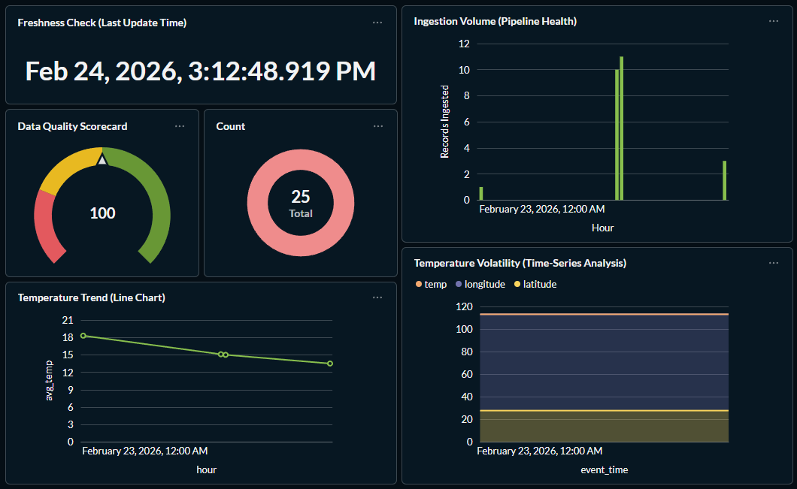
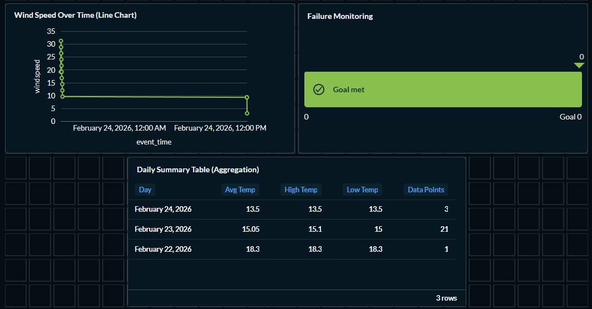

# Real-Time Weather Event Analytics Pipeline (No-Cloud, Free Stack)

## Overview
This project demonstrates a production-style data engineering pipeline built entirely with free, local tools. The pipeline ingests real-time weather data from a public API, lands raw JSON into a local data lake, loads curated data into a PostgreSQL warehouse, transforms it into analytics-ready tables, and orchestrates workflows using Apache Airflow.

## Architecture
Public API (Open-Meteo)  
→ Python Ingestion  
→ Raw Data Lake (local files)  
→ PostgreSQL (data warehouse via Docker)  
→ Apache Airflow (orchestration + scheduling)

## Tech Stack
- Python
- SQL
- Docker
- PostgreSQL (local warehouse)
- Apache Airflow (local orchestration)

## Project Structure

```text
de-event-pipeline/
├── ingestion/      
├── airflow/        
├── data_lake/      
├── requirements.txt
├── .gitignore
└── README.md
```

## Setup
```bash
python -m venv venv
venv\Scripts\activate
pip install -r requirements.txt
python ingestion/fetch_weather.py
```
## Analytics Screenshots

